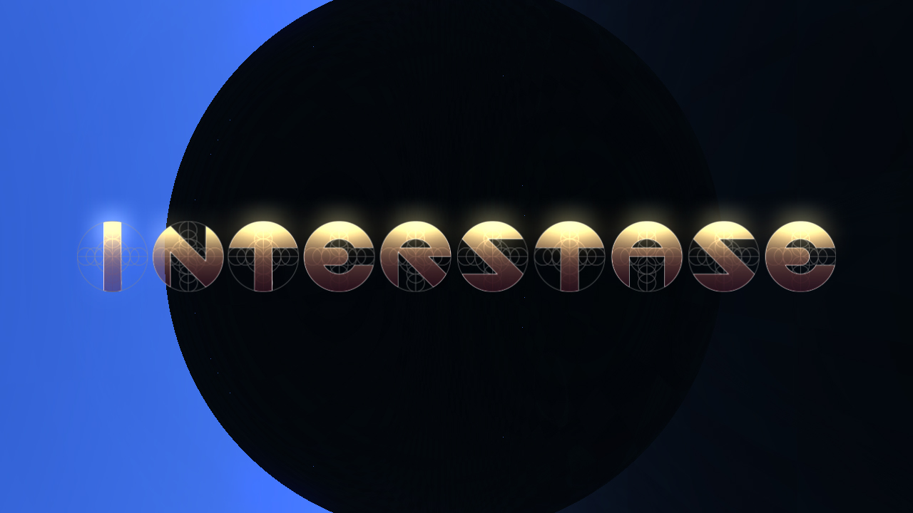

# Interstase
RealTime demo presented at [Revision 2015](https://youtu.be/ZKKuXK1YXZ8?t=3547)
___

___
## License

| Part | License |
| --- | --- |
| Source code | [MIT](LICENSE) — Eric Kernin (Erk) |
| Assets (graphics, textures, fonts, most 3D models) | [CC0 1.0](https://creativecommons.org/publicdomain/zero/1.0/) — Eric Kernin (Erk) |
| Astronaut 3D model | [CC0 1.0](https://creativecommons.org/publicdomain/zero/1.0/) — François Guterz (Fra) |
| Soundtrack, spaceship 3D model, title logo and thumbnail | [CC BY-NC 4.0](https://creativecommons.org/licenses/by-nc/4.0/) — Gwenaël Dano (Gwen) |
| Bundled libraries (GLEW, GLFW, libpng, BASS) | their own licenses — see [THIRD-PARTY.md](THIRD-PARTY.md) |

See [LICENSES.md](LICENSES.md) for the details and the exact file lists.
Note that `bass.dll` is proprietary and free for non-commercial use only.
